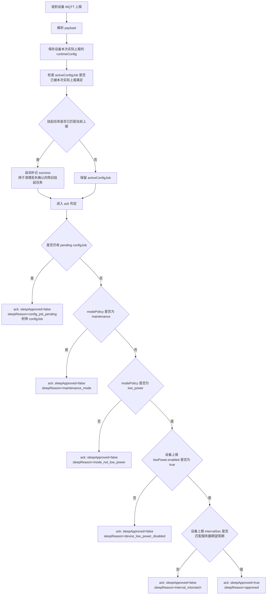
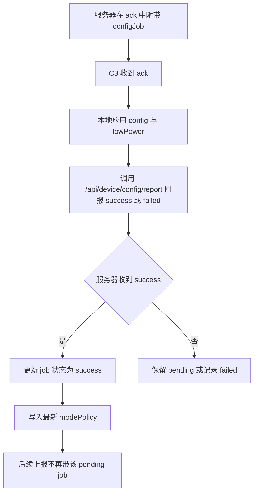
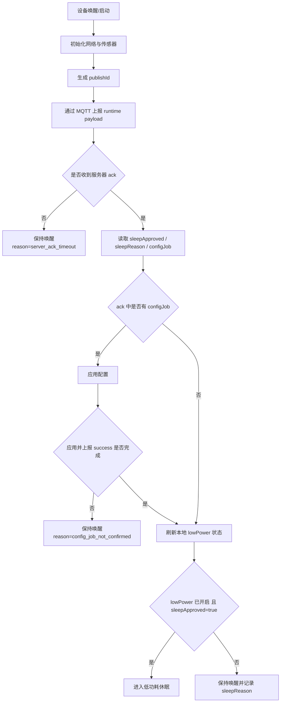

# 06-ESP32-C3-模式状态机与模式说明

## 文档基线

- 更新时间：2026-04-25
- 固件基线：`01-firmware/00-main-c3-firmware/main/include/app_config.h` 中的 `v1.1.43`
- 服务器基线：`03-server/01-net-display-server/server.js`
- 前端基线：`03-server/01-net-display-server/public/app.js`

## 1. 结论

当前代码已经将 ESP32-C3 的“模式控制”拆成了两层：

1. 设备本地只保存低功耗运行参数。
   设备本地 `lowPower` 只保留 `enabled` 和 `intervalSec` 两个有效状态，`maintenanceMode` 已不再作为设备侧权威状态使用。
2. 服务器负责决定本轮是否批准休眠。
   C3 每次上报后，服务器必须立即返回 ack，并根据“设备实际上报状态”和“服务器当前期望状态”决定：
   - 返回 `sleepApproved=true`，允许本轮进入休眠。
   - 返回 `sleepApproved=false`，阻止本轮进入休眠。
   - 如有挂起配置任务，则在 ack 中同时下发 `configJob`。
3. 维修站模式已经变成服务器侧策略。
   维修站模式的本质不再是往设备里写一个本地 `maintenanceMode=true`，而是服务器收到设备上报后，不再给该设备下发休眠批准。
4. C3 进入休眠的前提已经收敛为一个统一条件。
   只有同时满足“低功耗已开启、上报成功、收到服务器 ack、配置任务已完成、服务器明确批准休眠”时，C3 才会进入低功耗休眠。

## 2. 当前状态的来源与权威性

| 信息项 | 代码位置 | 作用 | 谁是权威 |
| --- | --- | --- | --- |
| `currentConfig` | `server.js` 中 `getCurrentDeviceRuntimeConfig()` | 服务器记录的设备最近一次实际上报配置 | 设备实际上报 |
| `modePolicy` | `server.js` 中 `getDeviceModePolicy()` | 服务器当前生效的模式策略 | 服务器 |
| `activeConfigJob` | `server.js` 中 `getActiveDeviceConfigJobForDevice()` | 服务器挂起、等待设备确认的目标配置 | 服务器挂起任务 |
| `sleepApproved` / `sleepReason` | `server.js` 中 `publishDeviceAck()` | 服务器对本轮上报的即时判定 | 本轮 ack |
| `configJob` | `publishDeviceAck()` 中随 ack 返回 | 本轮需要设备执行的配置任务 | 服务器挂起任务 |
| `lowPower.enabled` / `intervalSec` | `device_profile.c` | C3 本地低功耗行为参数 | 设备本地 |

需要特别注意：

- “当前模式”不等于“待执行模式”。
  当前模式表示服务器当前已经生效的策略。
- “待执行模式”来自 `activeConfigJob`。
  它表示服务器已经挂起、等待设备在后续交互中确认的目标模式。
- 对低功耗模式来说，是否真的已经切换成功，要看设备后续上报是否与目标一致。
- 对维修站模式来说，本地不再写 `maintenanceMode=true`，但服务器依然会把“阻止休眠批准”作为当前策略执行。

## 3. 最新模式定义

### 3.1 正常模式 `normal`

- 服务器策略：不批准休眠。
- 设备本地：通常为 `lowPower.enabled=false`。
- 设备行为：保持常醒，按正常在线节奏持续上报。
- 当前补充：
  - 管理端当前不再提供把设备长期切到 `normal` 的入口。
  - 从 `v1.1.43` 开始，设备在“非 deep sleep 唤醒的重启”后，如果本地低功耗已开启，会先进入一个临时 `20s` 正常窗口。
  - 这 `20s` 内状态灯常亮，设备保持唤醒，给本地按键进入维修站留出操作时间。
- 典型用途：联调、实时观察、常在线展示。

### 3.2 低功耗模式 `low_power`

- 服务器策略：只有当设备实际上报状态与服务器预期一致时，才会批准本轮休眠。
- 设备本地：
  - `lowPower.enabled=true`
  - `lowPower.intervalSec=配置周期`
- 设备行为：
  - 唤醒后完成采集与上报。
  - 等待服务器 ack。
  - 如果 ack 中 `sleepApproved=true`，则进入休眠。
  - 如果 ack 中 `sleepApproved=false`，则本轮保持唤醒。

### 3.3 维修站模式 `maintenance`

- 服务器策略：始终阻止休眠批准。
- 设备本地：
  - 不再依赖本地 `maintenanceMode=true`。
  - 当前代码会把设备上报中的 `maintenanceMode` 固定为 `false`。
- 设备行为：
  - 设备仍会正常上报。
  - 服务器 ack 始终返回 `sleepApproved=false`。
  - 适合 OTA、串口调试、网页联机排查。

## 4. 服务器侧最新决策流程

服务器当前的关键目标不是“先把配置挂起”，而是“每收到一次设备上报，就必须立即给出本轮是否允许休眠的决定”。

### 4.1 MQTT 上报处理主流程

### 4.2 配置任务确认流程

### 4.3 当前服务器判定字段

当前 ack 中至少会包含以下字段：

- `publishId`
- `serverMode`
- `sleepApproved`
- `sleepReason`
- `expectedIntervalSec`
- `configJob`

其中：

- `sleepApproved` 是 C3 本轮是否允许休眠的唯一服务器授权。
- `configJob` 表示这轮 ack 还要求设备执行配置任务。
- 只要服务器没有明确返回 `sleepApproved=true`，设备就不能进入休眠。

## 5. C3 侧最新运行状态机

### 5.1 单轮运行主流程

### 5.2 C3 进入休眠的硬条件

当前 `telemetry_app.c` 中，进入休眠要求同时满足：

1. `low_power_enabled == true`
2. `publish_succeeded == true`
3. `server_ack_received == true`
4. `config_job_completed == true`
5. `sleep_approved == true`

只要其中任意一项不成立，设备就不会休眠。

### 5.3 按键切换模式规则

从 `v1.1.43` 开始，按键切换规则已经改成“仅允许在重启后的临时正常窗口内，请求进入维修站”，不再做 `low_power` / `maintenance` 双向互切。

补充说明：

- 所有长按阈值统一为 `3s`；不足 `3s` 一律视为短按。
- 如果设备本地低功耗已开启，且本次属于“非 deep sleep 唤醒的重启”，固件会先进入 `20s` 临时正常窗口。
- 这 `20s` 内状态灯常亮，设备不会进入休眠。
- 只有在这 `20s` 窗口内长按按键达到 `3s`，固件才会排队一个 `modeRequest.targetMode=maintenance`。
- 长按事件不会直接在本地把模式改掉，而是会把 `modeRequest` 带进下一次 MQTT 上报，由服务器生成或复用对应的配置任务。
- 同一个目标模式如果已经排队，重复长按不会把请求取消，只会记录为 `already_queued`。
- 只有服务器 ack 返回的 `serverMode` 与待切换目标一致时，设备才会清掉本次待执行按键切换请求。
- 如果这 `20s` 内没有发生有效长按，窗口结束后设备会恢复到低功耗主流程；在满足服务器批准休眠等条件后自动重新进入低功耗。
- 当前按键规则不再支持“在维修站模式下长按切回低功耗”，该切换需要依赖服务器侧配置。

### 5.4 低功耗深睡下的按键行为

低功耗模式下，设备可能已经进入 deep sleep。此时按键行为需要按下面理解：

- 如果设备已经深睡，按键首先起到的是“GPIO 唤醒”作用。
- 由于 ESP32-C3 deep sleep 唤醒后会重新启动，唤醒前那一小段按压时长不会被原样保留。
- deep sleep 唤醒本身不会直接触发维修站切换请求。
- 如果这次唤醒属于 deep sleep 定时/按键唤醒后的常规恢复，设备会继续走低功耗那一轮采集、上报、等 ack、再决定是否休眠的流程。
- 想通过按键切换到维修站，需要先让设备发生一次“非 deep sleep 唤醒的重启”，进入启动后的 `20s` 正常窗口，再在窗口内长按 `3s`。

## 6. `sleepReason` 判定表

| `sleepReason` | 含义 | 本轮是否休眠 | 说明 |
| --- | --- | --- | --- |
| `approved` | 服务器批准休眠 | 是 | 仅在低功耗模式且设备状态与目标一致时出现 |
| `config_job_pending` | 还有挂起配置任务 | 否 | 服务器会优先让设备吃到配置，不允许直接睡 |
| `maintenance_mode` | 当前服务器模式为维修站 | 否 | 维修站模式本质是服务器阻止休眠批准 |
| `mode_not_low_power` | 当前服务器模式不是低功耗 | 否 | 常见于正常模式 |
| `device_low_power_disabled` | 设备上报本地低功耗未开启 | 否 | 设备与服务器目标不一致 |
| `interval_mismatch` | 设备上报周期与服务器期望不一致 | 否 | 设备需要先完成配置切换 |

## 7. 关键代码落点

### 7.1 服务器

- `server.js`
  - `handleMqttPacket()`
    服务器收到设备 MQTT 上报后的入口。
  - `reconcilePendingConfigJobFromRuntime()`
    用设备当前上报状态自动补核销陈旧 pending 任务。
  - `deriveSleepApproval()`
    按当前上报与服务器策略计算 `sleepApproved` 和 `sleepReason`。
  - `publishDeviceAck()`
    立即向设备返回 ack。
  - `updateDeviceConfigJobStatus()`
    在设备回报 success 后更新任务并写入最新 `modePolicy`。

### 7.2 固件

- `telemetry_app.c`
  - 负责上报、等待 ack、解析 `sleepApproved`、决定是否休眠。
- `remote_config_service.c`
  - 解析 ack 中的 `sleepApproved`、`sleepReason`、`configJob`。
  - 在应用配置成功后，回报 `/api/device/config/report`。
- `device_profile.c`
  - 统一设备本地配置读写。
  - 当前已经把 `maintenanceMode` 规范化为服务器侧概念，不再作为设备本地有效模式。

### 7.3 前端

- `public/app.js`
  - 管理员页中的“模式配置”只允许单选一个模式。
  - 模式配置下拉框现在只保留 `low_power` 和 `maintenance` 两个选项，不再提供 `normal` 入口。
  - “当前模式”展示的是服务器当前策略。
  - “待执行模式”展示的是服务器已挂起、等待设备确认的目标模式。
  - 维修站模式下不再展示低功耗休眠时间。

## 8. 与旧设计的差异

以下旧说法已经不再适合作为当前实现说明：

1. “设备自己决定何时休眠”。
   现在不是。当前实现必须以服务器 ack 为准。
2. “维修站模式写入设备本地 lowPower.maintenanceMode”。
   现在不是。维修站模式已经上收为服务器策略。
3. “只要开启低功耗，设备每轮上报后一定直接睡眠”。
   现在不是。必须等服务器 ack 明确批准。
4. “服务器挂起了配置任务也不影响设备休眠”。
   现在不是。只要配置任务未闭环，服务器会优先阻止休眠。
5. “低功耗模式下设备睡着时，按键唤醒后继续按住就能直接切到维修站”。
   现在不是。从 `v1.1.43` 起，这条逻辑已经取消；需要先重启进入 `20s` 正常窗口，再在窗口内长按 `3s` 请求切到维修站。

6. “维修站模式下长按还可以再切回低功耗”。
   当前也不是。`v1.1.43` 起，按键只负责在启动窗口里请求进入 `maintenance`，不再承担双向互切。

## 9. 排障建议

当出现“设备明明开了低功耗，但一直没有休眠”时，建议按下面顺序排查：

1. 看服务器 `activeConfigJob` 是否仍为 `pending`。
   只要还有挂起任务，`sleepReason` 很可能就是 `config_job_pending`。
2. 看服务器 `modePolicy.mode` 是否其实已经是 `maintenance`。
   维修站模式下服务器会持续阻止休眠批准。
3. 看设备实际上报的 `currentConfig.lowPower.enabled` 和 `intervalSec` 是否与服务器期望一致。
   不一致时会出现 `device_low_power_disabled` 或 `interval_mismatch`。
4. 看设备串口或事件流中是否存在 ack 超时。
   如果没收到 ack，C3 会保持唤醒，不会睡眠。
5. 看设备是否已经执行了 ack 中的配置任务，并成功回报 `/api/device/config/report`。
   如果应用成功但确认丢失，服务器现在会在后续 MQTT 上报中尝试自动补核销。

## 10. 当前文档适用范围

本文件描述的是当前代码已经实现的权威流程，适用于：

- `03-server/01-net-display-server/server.js`
- `03-server/01-net-display-server/public/app.js`
- `01-firmware/00-main-c3-firmware/main/app/telemetry_app.c`
- `01-firmware/00-main-c3-firmware/main/app/remote_config_service.c`
- `01-firmware/00-main-c3-firmware/main/app/device_profile.c`

如果后续再次调整“服务器策略是否立即生效”或“维修站模式是否需要设备确认”的规则，本文件需要同步修订。
