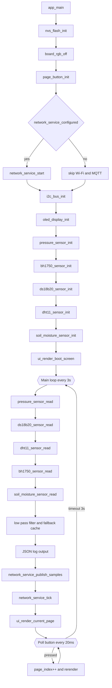
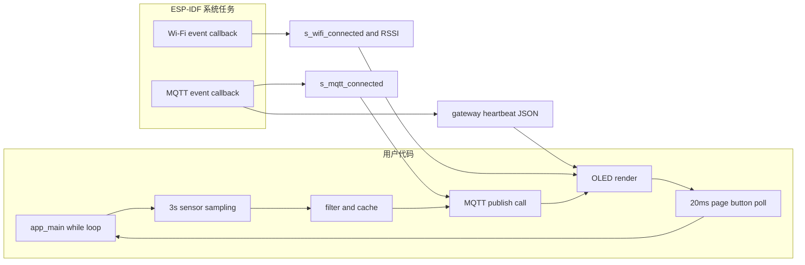

# IDF Multi Sensor Pages Demo

这是一个给 `YD-ESP32-S3` 准备的多传感器分页显示工程。

虽然目录名还叫 `05-idf-3sensor-pages-demo`，但当前程序已经整理成 `7` 个页面：

1. 气压计页面
2. `DS18B20` 页面
3. `DHT11` 页面
4. `BH1750` 页面
5. 土壤湿度页面
6. 雨水页面
7. 水泵页面

这次重构的重点是：

- 把 `main` 里原来塞在一个文件中的驱动和业务逻辑拆到独立目录
- 每个模块按模块名建文件夹，方便维护
- 新增土壤湿度驱动、页面、日志和 MQTT 上报
- 新增雨水驱动、页面、日志和 MQTT 上报
- 在 README 中补齐接线、周期、流程图和资料链接

## 目录结构

当前 `main` 目录已经按模块拆开：

```text
main/
├─ app/                公共配置与数据结构
├─ bh1750/             BH1750 驱动
├─ board/              板级初始化
├─ dht11/              DHT11 驱动
├─ ds18b20/            DS18B20 驱动
├─ i2c_bus/            I2C 总线封装
├─ network/            Wi-Fi / MQTT / 网关状态
├─ oled_display/       OLED 显示驱动
├─ page_button/        翻页按钮输入
├─ pressure/           BMP180 / BMP280 / BME280 驱动
├─ rain/               雨水传感器驱动
├─ soil_moisture/      土壤湿度驱动
├─ ui/                 页面渲染
└─ main.c              主流程编排
```

## GPIO 分配

### 传感器和显示器

- OLED I2C `SDA` -> `GPIO5`
- OLED I2C `SCL` -> `GPIO6`
- 气压计 `SDA` -> `GPIO5`
- 气压计 `SCL` -> `GPIO6`
- `BH1750 SDA` -> `GPIO5`
- `BH1750 SCL` -> `GPIO6`
- `DS18B20 DQ` -> `GPIO7`
- `DHT11 DATA` -> `GPIO4`
- 土壤湿度 `AO` -> `GPIO8`
- 雨水传感器 `AO` -> `GPIO9`

### 控制和板载资源

- 翻页按钮 -> `GPIO15`
- 板载 RGB -> `GPIO48`
- `BOOT` 按键 -> `GPIO0`
- 原生 USB -> `GPIO19 / GPIO20`

## 接线总表

| 模块 | 引脚 | 开发板连接 |
| --- | --- | --- |
| OLED | VCC | `3V3` |
| OLED | GND | `GND` |
| OLED | SDA | `GPIO5` |
| OLED | SCL | `GPIO6` |
| 气压计 | VCC | `3V3` |
| 气压计 | GND | `GND` |
| 气压计 | SDA | `GPIO5` |
| 气压计 | SCL | `GPIO6` |
| BH1750 / GY-302 | VCC | `3V3` |
| BH1750 / GY-302 | GND | `GND` |
| BH1750 / GY-302 | SDA | `GPIO5` |
| BH1750 / GY-302 | SCL | `GPIO6` |
| DS18B20 | VDD | `3V3` |
| DS18B20 | GND | `GND` |
| DS18B20 | DQ | `GPIO7` |
| DHT11 | VCC | `3V3` |
| DHT11 | GND | `GND` |
| DHT11 | DATA | `GPIO4` |
| 土壤湿度模块 | VCC | `3V3` |
| 土壤湿度模块 | GND | `GND` |
| 土壤湿度模块 | `AO` | `GPIO8` |
| 雨水传感器模块 | VCC | `3V3` |
| 雨水传感器模块 | GND | `GND` |
| 雨水传感器模块 | `AO` | `GPIO9` |
| 翻页按钮 | 一端 | `GPIO15` |
| 翻页按钮 | 另一端 | `GND` |

## 土壤湿度模块说明

当前驱动按常见的 `AO/DO` 模拟土壤湿度模块来接入，程序只使用：

- `AO` 模拟输出
- `VCC`
- `GND`

没有使用比较器数字口 `DO`。

当前土壤湿度算法是一个可调的线性映射：

- `ADC_DRY_RAW = 3000`
- `ADC_WET_RAW = 1300`

程序会把 ADC 原始值映射成 `0 ~ 100%` 的湿度百分比，所以你后面拿到真实模块后，最好按你的土壤和探头重新校准这两个值。

### 资料链接

- 土壤湿度模块购买/资料链接：
  `https://item.taobao.com/item.htm?id=605702777228&mi_id=0000bvaJajfSU-Q5FH9BEXynhnm91ReWZ9z68lSM3mkswss&spm=tbpc.boughtlist.suborder_itemtitle.1.2b5f2e8diwmlPr`

## 雨水传感器说明

当前驱动按常见雨滴 / 雨量模拟模块来接入，程序只使用：

- `AO` 模拟输出
- `VCC`
- `GND`

默认使用：

- `GPIO9`

选择这个 IO 的原因：

- 当前工程里没有和 I2C、单总线、按键、RGB 资源冲突
- `ESP32-S3` 上可以直接作为 ADC 输入
- 适合后续继续做阈值和雨量强度校准

当前雨水换算参数：

- `RAIN_SENSOR_ADC_DRY_RAW = 3200`
- `RAIN_SENSOR_ADC_WET_RAW = 1400`
- `RAIN_SENSOR_ACTIVE_THRESHOLD_PCT = 8.0`

程序会把 ADC 原始值换算成 `0 ~ 100%` 的 `rainLevel`，并用阈值推断 `isRaining`。

## I2C 总线说明

- OLED、气压计和 `BH1750` 都并联在同一组 `GPIO5 / GPIO6`
- 所有这些模块都必须共地
- 电源统一建议接 `3V3`
- 常见 I2C 地址：
  - OLED：`0x3C` 或 `0x3D`
  - `BH1750`：`0x23` 或 `0x5C`
  - 气压计：通常 `0x76` 或 `0x77`

## 页面内容

### 第 1 页

- 气压计型号
- 气压 `Pa`
- 温度 `C`
- 相对高度 `m`

### 第 2 页

- `DS18B20`
- 温度 `C`

### 第 3 页

- `DHT11`
- 温度 `C`
- 湿度 `%`

### 第 4 页

- `BH1750`
- 光照 `lux`

### 第 5 页

- 土壤湿度百分比 `%`
- ADC 原始值 `raw`

### 第 6 页

- 下雨状态
- 雨量强度 `%`

### 第 7 页

- 水泵状态
- 剩余秒数

## 程序周期与刷新节奏

### 主循环周期

- 主采样、日志、上报、页面刷新：每 `3s` 一轮

### 按钮轮询

- 主循环内会在 `3s` 的空档期内按 `20ms` 轮询翻页按钮
- 按下后立即切换到下一页，并立刻重绘 OLED

### 各模块采样特征

- 气压计：I2C 即时读取，耗时较短
- `BH1750`：I2C 即时读取，耗时较短
- 土壤湿度：ADC 单次采样，耗时较短
- 雨水传感器：ADC 单次采样，耗时较短
- `DHT11`：单次采样失败时最多重试 `3` 次，每次失败后间隔 `30ms`
- `DS18B20`：一次测温会等待大约 `800ms` 完成温度转换

### 上报周期

- 传感器 MQTT 上报：随主循环，每 `3s` 一次
- 网关 ping：每 `25s` 一次
- 网关状态超时判定：`60s`

## 线程 / 任务模型

这个工程的用户代码没有再额外创建自定义 FreeRTOS 任务，主体是一个 `app_main()` 主循环。

但运行时仍然有两类“并发来源”需要理解：

1. 用户主循环
   - 负责采样、滤波、日志、MQTT 上报调用、OLED 渲染、按钮轮询
2. `ESP-IDF` 系统任务和事件回调
   - `Wi-Fi` 连接事件回调
   - `MQTT` 连接、断开、数据接收回调
   - 网关心跳 JSON 状态更新

也就是说：

- 传感器驱动是“同步读”
- 网络状态维护是“事件驱动”
- OLED 页面显示由主循环统一刷新

## 整体流程图



## 并发与事件关系图



## 过滤与容错策略

- 气压、`DS18B20`、`DHT11`、`BH1750`、土壤湿度都加了低通滤波
- 某轮采样失败时，优先回退到上一份滤波值
- 如果还没有滤波值，再回退到最近一次成功值
- `DHT11` 内部自带重试和最近值回退

## 构建

```powershell
cd F:\01-dev-board\06-esp32s3\YD-ESP32-S3\01-esp32-s3\03-project\05-idf-3sensor-pages-demo
. D:\02-software-stash-cache\02-esp32-idf\Initialize-Idf.ps1
idf.py set-target esp32s3
idf.py build
```

## 烧录

等你接好线后再执行：

```powershell
idf.py -p COMx flash
idf.py -p COMx monitor
```

## 当前实现备注

- 项目已经完成模块化重构
- 已新增土壤湿度页面、日志和 MQTT 上报
- 已在本机按 `esp32s3` 目标编译通过
- 当前还没有烧录，等你线接好后再烧
