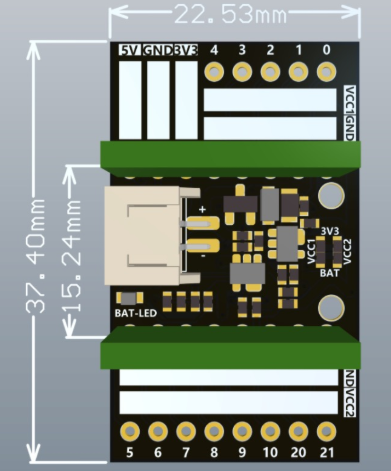
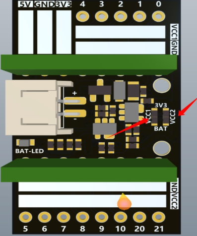

# 使用手册

## 简介

ESP32C3Supermini扩展板是一块专门为ESP32C3supermini开发板设计的一款扩展板，弥补了ESP32C3Supermini开发板的许多不足，使用扩展板可以外接一个3.7V锂电池，支持通过USB给锂电池充电，充电时绿色指示灯亮起，当绿色指示灯熄灭时，锂电池充满电，扩展引出了所有IO口，方便用户接各种各样的传感器。

## 尺寸图

## 电源

ESP32C3Supermini扩展板可以接入3.7V锂电池（PH2.0接口的锂电池）

## 提示

ESP32C3Supermini扩展板给用户提供一个更好的供电解决方案，扩展板共有VCC1、VCC2两个供电。默认VCC1、VCC2输出的电压是3.3V，当你需要输出更高的电压时，你可以将PCB（如下图的位置）短接起来，此时VCC1、VCC2输出的电压是电源电压3.7V。默认出厂是使用的0R电阻连接到的3.3V，如果需要输出3.7V，直接将0R电阻去掉，将三个焊盘用锡短接。VCC1、VCC2分别控制电压输出，需要用到拿一个，就处理哪一个即可。

